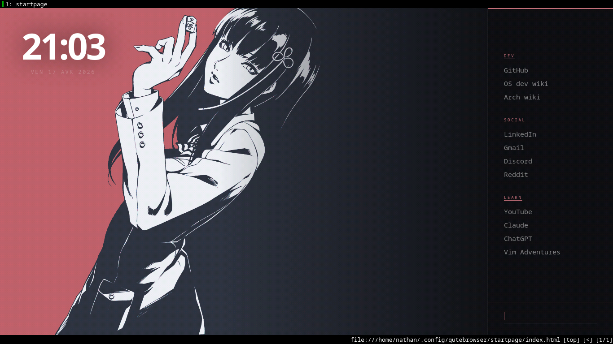

# Qutebrowser-config

My personal qutebrowser setup - minimal, keyboard-driven, anime-themed startpage.



## Structure

```
~/.config/qutebrowser/
├── config.py
├── autoconfig.yml
├── quickmarks
├── bookmarks/
│   └── urls
└── startpage/
    ├── index.html
    ├── style.css
    ├── script.js
    └── anime-nord.png
```

## Startpage

- Live clock & date in French
- Categorized quicklinks — dev, social, learn
- Search bar with custom shortcuts
- Fonts: [Syne](https://fonts.google.com/specimen/Syne) + [DM Mono](https://fonts.google.com/specimen/DM+Mono)

### Search shortcuts

| Prefix | Engine |
|--------|--------|
| `gh ` | GitHub search |
| `aw ` | Arch wiki |
| `yt ` | YouTube |
| `ddg ` | DuckDuckGo |
| `od` | OSDev wiki |
| `cd` | Claude |

## Install

```bash
git clone https://github.com/nathanWorkout/Qutebrowser-config.git ~/.config/qutebrowser
```

> Change the wallpaper path in `style.css` if needed.
